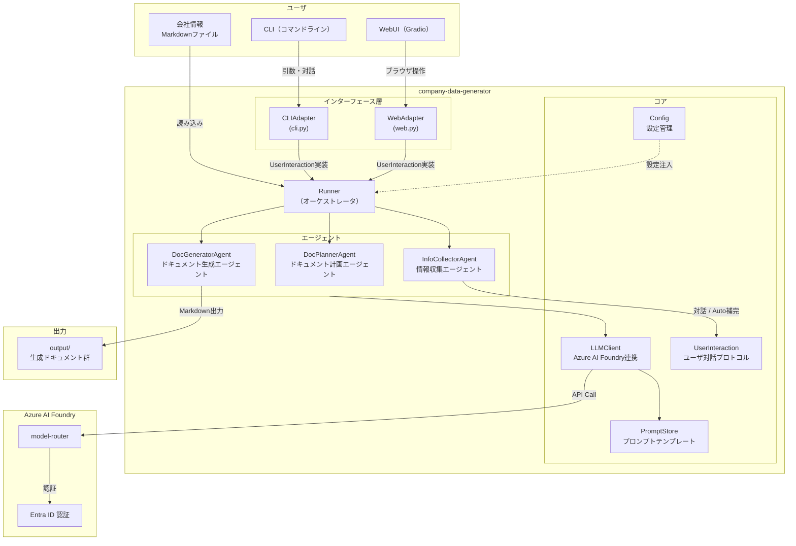
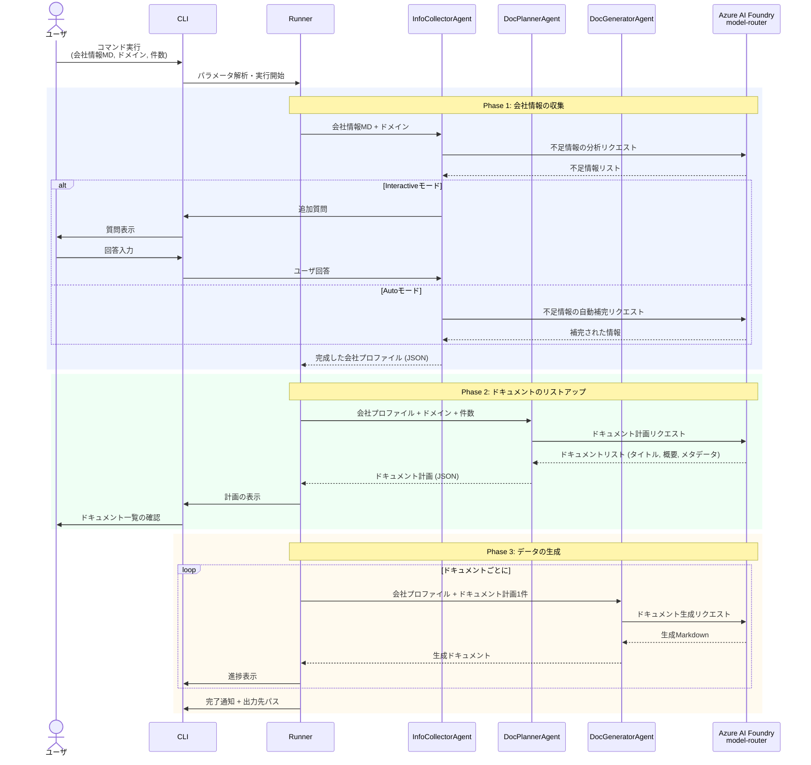
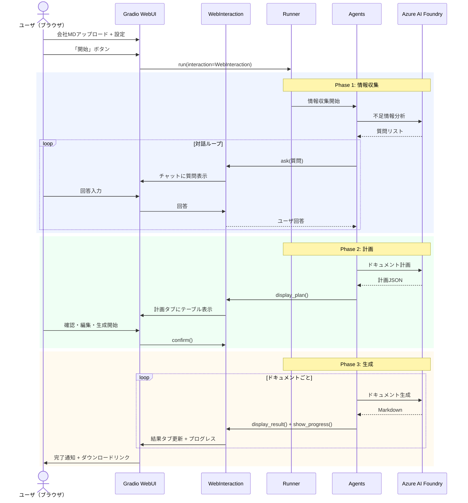
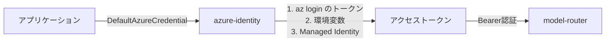
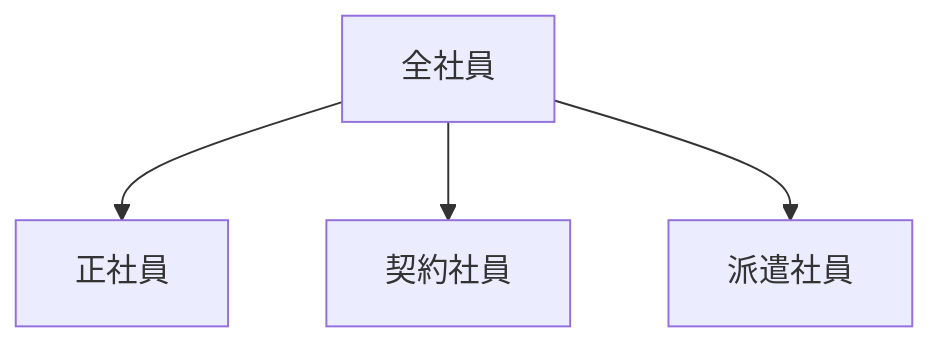

# 会社データジェネレータ

## コレは何？

架空の日本国内の株式会社の社内データを生成するためのジェネレータです。

## どうやって使うの？

会社情報をマークダウン形式で記述して、それに沿った特定のドメイン（営業や人事、設計、製造、カスタマーサポートなどの業務部門）のデータの作成を依頼すると、指定した件数分、実際には存在しない内規や会議資料など生成してくれます。

## どうやって動くの？

データの生成はLLMを利用して行います。エージェントは、以下のようなステップでデータを生成します。

+ **会社情報の収集**: ユーザが与えたマークダウンと作成してほしいデータのドメインから、必要な追加情報をユーザに収集します。Autoモードを選択している場合、エージェントが前提条件を考えて不足している情報に設定します。
+ **ドキュメントのリストアップ**: エージェントは指定されたドメインで「一般的な日本の会社で存在しそうな」資料を類推し、指定した件数分のリストと資料の概要を出力します。
+ **データの生成**: 出力されたドキュメントリストに従って、エージェントはドキュメントをマークダウン形式で生成します。マークダウンの中には、必要に応じてMermaid形式で図を含みます。

## 必要なリソース

LLMはAzure AI Foundry上のmodel-routerを利用します。model-routerへのアクセスに必要な認証は、Entra ID認証を使用します。

---

## アーキテクチャ

### 全体構成



### 処理フロー



---

## 技術スタック

| カテゴリ | 技術 | 備考 |
|---|---|---|
| 言語 | Python 3.12+ | 型ヒント必須 |
| パッケージ管理 | uv | 高速な依存関係管理 |
| CLI フレームワーク | click | コマンド定義・引数解析 |
| ターミナルUI | rich | 進捗バー・テーブル・色付き出力 |
| WebUI | gradio | ブラウザベースの対話UI・Mermaidレンダリング対応 |
| LLM連携 | azure-ai-inference | Azure AI Foundry model-router SDK |
| 認証 | azure-identity | Entra ID（DefaultAzureCredential） |
| データモデル | pydantic | 入出力スキーマのバリデーション |
| テンプレート | Jinja2 | プロンプトテンプレート管理 |
| テスト | pytest | ユニット・統合テスト |
| リンター/フォーマッタ | ruff | lint + format |

---

## ディレクトリ構成

```
company-data-generator/
├── pyproject.toml                  # プロジェクト定義・依存関係
├── uv.lock                        # ロックファイル
├── README.md
├── doc/
│   └── desgin.md                   # 本設計書
├── prompts/                        # プロンプトテンプレート (Jinja2)
│   ├── collect_info.md.j2          # Phase1: 不足情報分析プロンプト
│   ├── auto_complete.md.j2         # Phase1: Auto補完プロンプト
│   ├── plan_documents.md.j2        # Phase2: ドキュメント計画プロンプト
│   └── generate_document.md.j2     # Phase3: ドキュメント生成プロンプト
├── src/
│   └── company_data_generator/
│       ├── __init__.py
│       ├── cli.py                  # CLIエントリポイント (click)
│       ├── web.py                  # WebUIエントリポイント (Gradio)
│       ├── interaction.py          # ユーザ対話プロトコル定義
│       ├── runner.py               # 全体オーケストレーション
│       ├── config.py               # 設定管理
│       ├── models.py               # Pydanticデータモデル
│       ├── llm_client.py           # Azure AI Foundry連携
│       ├── prompt_store.py         # プロンプトテンプレートの読込・レンダリング
│       └── agents/
│           ├── __init__.py
│           ├── base.py             # エージェント基底クラス
│           ├── info_collector.py   # 情報収集エージェント
│           ├── doc_planner.py      # ドキュメント計画エージェント
│           └── doc_generator.py    # ドキュメント生成エージェント
├── tests/
│   ├── conftest.py
│   ├── test_cli.py
│   ├── test_web.py
│   ├── test_interaction.py
│   ├── test_runner.py
│   ├── test_models.py
│   ├── test_llm_client.py
│   └── agents/
│       ├── test_info_collector.py
│       ├── test_doc_planner.py
│       └── test_doc_generator.py
└── examples/                       # サンプル会社情報
    └── sample_company.md
```

---

## コンポーネント詳細設計

### 1. ユーザ対話プロトコル (`interaction.py`)

CLI と WebUI の両方から Runner を利用できるようにするための抽象レイヤー。エージェントがユーザと対話する際、具体的なUI実装を知らずにこのプロトコル経由で行う。

```python
class UserInteraction(Protocol):
    """ユーザ対話の抽象プロトコル

    CLIとWebUIの両方がこのプロトコルを実装し、
    Runner / Agent は具体的なUIを意識せずにユーザとやり取りできる。
    """

    async def ask(self, question: str, choices: list[str] | None = None) -> str:
        """ユーザに質問して回答を得る

        Args:
            question: 質問文
            choices: 選択肢（Noneの場合は自由入力）
        Returns:
            ユーザの回答文字列
        """
        ...

    async def confirm(self, message: str) -> bool:
        """ユーザに確認を求める (Yes/No)

        Args:
            message: 確認メッセージ
        Returns:
            Trueなら承認
        """
        ...

    async def show_progress(self, current: int, total: int, message: str) -> None:
        """進捗を表示する

        Args:
            current: 現在の進捗数
            total: 全体数
            message: 進捗メッセージ
        """
        ...

    async def display_plan(self, plan: "DocumentPlanList") -> None:
        """ドキュメント計画を表示する

        Args:
            plan: ドキュメント計画リスト
        """
        ...

    async def display_result(self, document: "GeneratedDocument") -> None:
        """生成結果を表示する

        Args:
            document: 生成されたドキュメント
        """
        ...
```

**実装クラスの対応関係:**

| プロトコルメソッド | CLI実装 (`CLIInteraction`) | WebUI実装 (`WebInteraction`) |
|---|---|---|
| `ask()` | `rich.prompt.Prompt` | Gradio `ChatInterface` のメッセージ応答 |
| `confirm()` | `rich.prompt.Confirm` | Gradio ボタンクリック待ち |
| `show_progress()` | `rich.progress.Progress` | `gr.Progress` プログレスバー |
| `display_plan()` | `rich.table.Table` | 計画タブの `gr.Dataframe` |
| `display_result()` | ファイルパス表示 | 結果タブの Markdown プレビュー |

### 2. CLI (`cli.py`)

Click ベースのコマンドラインインターフェース。

```
Usage: company-data-generator [OPTIONS] COMPANY_FILE

Options:
  --domain TEXT         生成対象のドメイン (例: 営業, 人事, 設計, 製造, カスタマーサポート)  [必須]
  --count INTEGER       生成するドキュメント数  [デフォルト: 5]
  --mode [interactive|auto]  情報収集モード  [デフォルト: interactive]
  --output-dir PATH     出力ディレクトリ  [デフォルト: ./output]
  --verbose             詳細ログ出力
  --help                ヘルプを表示
```

**実行例:**

```bash
# 対話モードで営業資料を5件生成
company-data-generator examples/sample_company.md --domain 営業 --count 5

# Autoモードで人事資料を10件生成
company-data-generator examples/sample_company.md --domain 人事 --count 10 --mode auto
```

### 3. WebUI (`web.py`)

Gradio ベースのブラウザUI。CLIと同じコアロジック（Runner）を利用したもう一つのフロントエンド。

**起動方法:**

```bash
# WebUI を起動
company-data-generator --web

# ポート指定
company-data-generator --web --port 7860
```

**画面構成 (3タブ):**

```mermaid
graph LR
    subgraph Tab1["① 設定 & 対話タブ"]
        Upload["会社情報MDアップロード"]
        Domain["ドメイン選択ドロップダウン"]
        Count["件数スライダー"]
        Mode["モード選択ラジオ"]
        Chat["チャットUI<br/>（情報収集対話）"]
    end

    subgraph Tab2["② 計画確認タブ"]
        Table["ドキュメント一覧テーブル"]
        Check["チェックボックス（選択/除外）"]
        StartBtn["生成開始ボタン"]
    end

    subgraph Tab3["③ 結果タブ"]
        Preview["Markdownプレビュー<br/>（Mermaid図レンダリング）"]
        FileList["生成ファイル一覧"]
        DLBtn["一括ダウンロードボタン"]
    end

    Tab1 -->|"情報収集完了"| Tab2
    Tab2 -->|"生成開始"| Tab3
```



**各タブの詳細:**

#### タブ1: 設定 & 対話

| Gradio コンポーネント | 用途 |
|---|---|
| `gr.File` | 会社情報Markdownファイルのアップロード |
| `gr.Dropdown` | ドメイン選択（営業, 人事, 設計, 製造, CS 等） |
| `gr.Slider` | 生成件数 (1〜30) |
| `gr.Radio` | モード選択 (Interactive / Auto) |
| `gr.ChatInterface` | Phase1 の情報収集対話 |

Interactive モードでは、InfoCollectorAgent が不足情報を質問する際に `WebInteraction.ask()` を呼び、チャットUI上でユーザと対話する。内部では `asyncio.Queue` を使い、Gradio のコールバックとエージェントの非同期処理を橋渡しする。

```python
class WebInteraction(UserInteraction):
    """チャットUI経由でユーザと対話する実装"""

    def __init__(self):
        self._question_queue: asyncio.Queue[str] = asyncio.Queue()
        self._answer_queue: asyncio.Queue[str] = asyncio.Queue()

    async def ask(self, question: str, choices: list[str] | None = None) -> str:
        """質問をチャットUIに送り、ユーザの回答を待つ"""
        prompt = question
        if choices:
            prompt += "\n" + "\n".join(f"  {i+1}. {c}" for i, c in enumerate(choices))
        await self._question_queue.put(prompt)
        return await self._answer_queue.get()

    async def respond_to_chat(self, user_message: str, history: list) -> str:
        """Gradio ChatInterface のコールバック。ユーザ入力をエージェントに渡し、
        次の質問を返す。"""
        await self._answer_queue.put(user_message)
        next_question = await self._question_queue.get()
        return next_question
```

#### タブ2: 計画確認

| Gradio コンポーネント | 用途 |
|---|---|
| `gr.Dataframe` | ドキュメント計画のテーブル表示（タイトル, 種別, 概要, ボリューム） |
| `gr.CheckboxGroup` | 生成対象から除外するドキュメントの選択 |
| `gr.Button` | 「生成開始」ボタン |

Phase 2 完了後に自動でこのタブに遷移し、ユーザは計画を確認・編集してから生成を開始できる。

#### タブ3: 結果

| Gradio コンポーネント | 用途 |
|---|---|
| `gr.Dropdown` | 生成済みドキュメントの選択 |
| `gr.Markdown` | 選択ドキュメントのMarkdownプレビュー（Mermaid図含む） |
| `gr.Progress` | 生成中の進捗バー |
| `gr.File` | 一括ダウンロード（ZIP） |

生成完了後、各ドキュメントをドロップダウンで切り替えながらプレビューできる。Gradio の Markdown コンポーネントは Mermaid をネイティブレンダリングするため、生成ドキュメントの図がそのまま表示される。

**WebUI 全体の処理フロー:**



### 4. データモデル (`models.py`)

Pydantic でスキーマを定義し、エージェント間のデータ受け渡しをバリデーション付きで行う。

```python
class CompanyProfile(BaseModel):
    """会社情報の完全なプロファイル"""
    name: str                           # 会社名
    industry: str                       # 業種
    employee_count: int                 # 従業員数
    founded_year: int                   # 設立年
    headquarters: str                   # 本社所在地
    business_description: str           # 事業概要
    departments: list[str]              # 部署一覧
    additional_context: dict[str, str]  # ドメイン別追加情報

class DocumentPlan(BaseModel):
    """生成するドキュメント1件の計画"""
    title: str              # ドキュメントタイトル
    doc_type: str           # 種別 (内規, 議事録, 報告書, マニュアル, etc.)
    summary: str            # 概要 (200字程度)
    target_audience: str    # 対象読者
    includes_diagram: bool  # Mermaid図を含むか
    estimated_length: str   # 想定ボリューム (short / medium / long)

class DocumentPlanList(BaseModel):
    """ドキュメント計画リスト"""
    domain: str                     # 対象ドメイン
    plans: list[DocumentPlan]       # 計画リスト

class GeneratedDocument(BaseModel):
    """生成されたドキュメント"""
    plan: DocumentPlan      # 元の計画
    content: str            # 生成されたMarkdown本文
    filename: str           # 出力ファイル名
```

### 5. LLMクライアント (`llm_client.py`)

Azure AI Foundry model-router への接続を管理する。

```python
class LLMClient:
    """Azure AI Foundry model-router クライアント"""

    def __init__(self, endpoint: str, credential: TokenCredential):
        """
        Args:
            endpoint: Azure AI Foundry のエンドポイントURL
            credential: Entra ID 認証情報 (DefaultAzureCredential)
        """
        ...

    async def chat(
        self,
        messages: list[dict[str, str]],
        temperature: float = 0.7,
        max_tokens: int = 4096,
        response_format: type[BaseModel] | None = None,
    ) -> str | BaseModel:
        """
        LLMにリクエストを送信する。
        response_format が指定された場合、Structured Output として
        Pydanticモデルにパースして返す。
        """
        ...
```

**認証フロー:**



### 6. プロンプトストア (`prompt_store.py`)

Jinja2 テンプレートを管理し、コンテキストに応じたプロンプトをレンダリングする。

```python
class PromptStore:
    """プロンプトテンプレートの管理"""

    def __init__(self, template_dir: Path):
        """prompts/ ディレクトリからテンプレートを読み込む"""
        ...

    def render(self, template_name: str, **kwargs) -> str:
        """テンプレートをレンダリングして文字列を返す"""
        ...
```

### 7. エージェント

#### 7.1 基底クラス (`agents/base.py`)

```python
class BaseAgent(ABC):
    """エージェントの基底クラス"""

    def __init__(self, llm_client: LLMClient, prompt_store: PromptStore):
        self.llm = llm_client
        self.prompts = prompt_store

    @abstractmethod
    async def run(self, *args, **kwargs) -> Any:
        """エージェントのメイン処理"""
        ...
```

#### 7.2 情報収集エージェント (`agents/info_collector.py`)

| 項目 | 内容 |
|---|---|
| 入力 | 会社情報Markdown, 対象ドメイン, モード(interactive/auto) |
| 出力 | `CompanyProfile` |
| 責務 | 会社情報MDをパースし、不足情報をユーザ対話またはLLM自動補完で収集する |

**処理フロー:**

1. 会社情報Markdownを読み込み、既知の情報を抽出
2. LLMに「指定ドメインのドキュメント生成に必要だが不足している情報」を分析させる
3. Interactive モード: ユーザに質問して補完 / Auto モード: LLMに自動生成させる
4. 完成した `CompanyProfile` を返す

#### 7.3 ドキュメント計画エージェント (`agents/doc_planner.py`)

| 項目 | 内容 |
|---|---|
| 入力 | `CompanyProfile`, ドメイン, 件数 |
| 出力 | `DocumentPlanList` |
| 責務 | 指定ドメインで日本企業に一般的なドキュメントを類推し、リスト化する |

**処理フロー:**

1. 会社プロファイルとドメイン情報をプロンプトに埋め込み
2. LLMにStructured Outputで `DocumentPlanList` を生成させる
3. 件数が指定数と一致するかバリデーション
4. `DocumentPlanList` を返す

#### 7.4 ドキュメント生成エージェント (`agents/doc_generator.py`)

| 項目 | 内容 |
|---|---|
| 入力 | `CompanyProfile`, `DocumentPlan` (1件) |
| 出力 | `GeneratedDocument` |
| 責務 | 計画に従い、リアルなMarkdownドキュメントを生成する |

**処理フロー:**

1. 会社プロファイルとドキュメント計画をプロンプトに埋め込み
2. LLMにMarkdownドキュメントを生成させる（Mermaid図含む場合あり）
3. 生成されたMarkdownを `GeneratedDocument` に格納
4. ファイル名を `{連番}_{doc_type}_{sanitized_title}.md` 形式で設定

### 8. Runner (`runner.py`)

全体のオーケストレーションを担当する。`UserInteraction` を受け取ることで、CLI/WebUIどちらからでも利用できる。

```python
class Runner:
    """生成パイプライン全体のオーケストレータ"""

    def __init__(self, interaction: UserInteraction, config: Config):
        """
        Args:
            interaction: ユーザ対話の実装 (CLIまたはWeb)
            config: アプリケーション設定
        """
        self.interaction = interaction
        ...

    async def run(
        self,
        company_file: Path,
        domain: str,
        count: int,
        mode: str,
        output_dir: Path,
    ) -> list[Path]:
        """
        メインパイプラインを実行する。

        Returns:
            生成されたドキュメントのファイルパスリスト
        """
        # Phase 1: 会社情報の収集
        profile = await self.info_collector.run(
            company_file, domain, mode, self.interaction
        )

        # Phase 2: ドキュメント計画
        plan = await self.doc_planner.run(profile, domain, count)
        await self.interaction.display_plan(plan)

        # Phase 3: ドキュメント生成 (1件ずつ逐次実行)
        generated = []
        for i, doc_plan in enumerate(plan.plans):
            await self.interaction.show_progress(
                i + 1, len(plan.plans), f"生成中: {doc_plan.title}"
            )
            doc = await self.doc_generator.run(profile, doc_plan)
            await self.interaction.display_result(doc)
            path = self._save_document(doc, output_dir)
            generated.append(path)

        return generated
```

### 9. 設定管理 (`config.py`)

```python
class Config(BaseModel):
    """アプリケーション設定"""
    azure_endpoint: str = Field(
        description="Azure AI Foundry エンドポイントURL",
    )
    temperature: float = Field(
        default=0.7,
        description="LLM生成のtemperature",
    )
    max_tokens: int = Field(
        default=4096,
        description="1リクエストあたりの最大トークン数",
    )
```

環境変数またはプロジェクトルートの `.env` ファイルから読み込む。

| 環境変数 | 必須 | 説明 |
|---|---|---|
| `AZURE_AI_ENDPOINT` | Yes | Azure AI Foundry エンドポイントURL |
| `LLM_TEMPERATURE` | No | temperature（デフォルト: 0.7） |
| `LLM_MAX_TOKENS` | No | 最大トークン数（デフォルト: 4096） |

---

## 出力仕様

### 出力ディレクトリ構造

```
output/
├── company_profile.json              # 生成に使用した会社プロファイル
├── document_plan.json                # ドキュメント計画
├── 01_内規_情報セキュリティポリシー.md
├── 02_議事録_営業戦略会議.md
├── 03_報告書_月次売上レポート.md
├── 04_マニュアル_新人営業研修.md
└── 05_企画書_新規顧客開拓プラン.md
```

### ドキュメントMarkdownのフォーマット

各生成ドキュメントは以下のYAML frontmatter付きMarkdownとする。

```markdown
---
title: "情報セキュリティポリシー"
doc_type: "内規"
domain: "営業"
company: "株式会社サンプル商事"
generated_at: "2026-02-24T10:30:00+09:00"
---

# 情報セキュリティポリシー

## 1. 目的

本ポリシーは...（本文）

## 2. 適用範囲



...
```

---

## エラーハンドリング

| エラー種別 | 対処 |
|---|---|
| 認証エラー (401/403) | `az login` の実行を促すメッセージを表示 |
| レートリミット (429) | 指数バックオフでリトライ（最大3回） |
| LLM出力パースエラー | リトライ（最大2回）。失敗時はスキップしてログ記録 |
| ファイルI/Oエラー | エラーメッセージを表示して終了 |

---

## 今後の拡張ポイント

+ **バッチ生成**: 複数ドメインの一括生成
+ **テンプレートカスタマイズ**: ユーザ独自のプロンプトテンプレート追加
+ **出力フォーマット**: Markdown以外（Word, PDF）のエクスポート対応
+ **品質チェック**: 生成ドキュメントの一貫性チェックエージェントの追加
+ **WebUI認証**: Gradio OAuth連携によるユーザ認証

